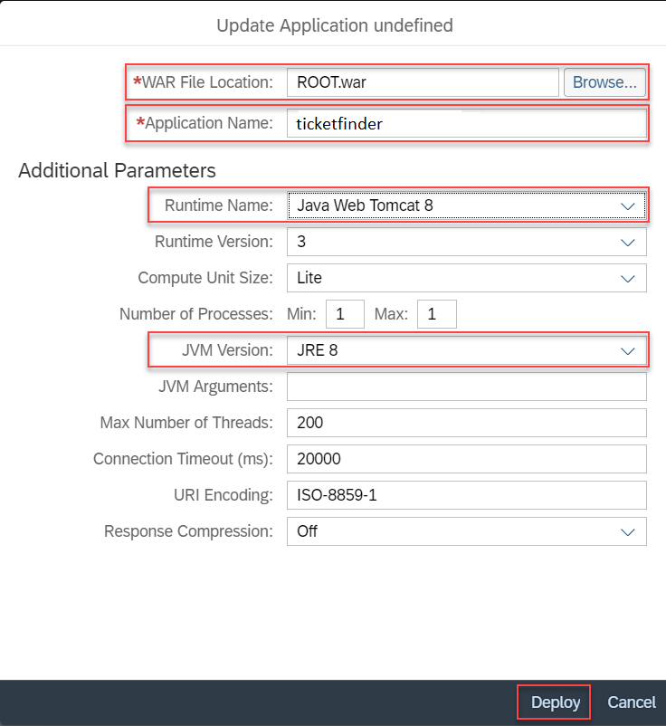
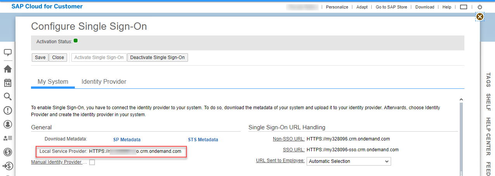
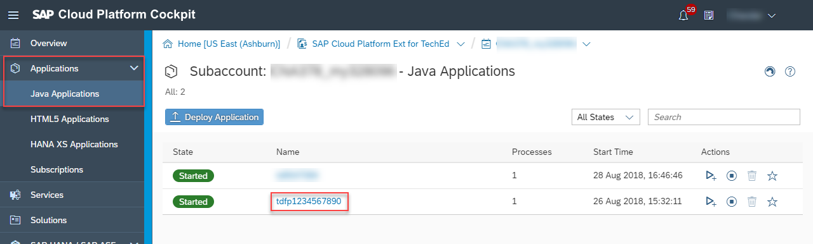

# cloud-c4c-ticket-duplicate-finder

## Introduction

SAP Cloud for Customer allows your company sales and support teams to engage with customers across multiple channels. You can use SAP Cloud Platform to develop, deploy and host SAP Cloud for Customer extension applications that simplify and differentiate your business processes.

The sample extension application for SAP Cloud for Customer that we will be showing - *SAP Duplicate Ticket Finder* - helps support employees in finding duplicate tickets reported for the same customer issues.

## Extension Applications Overview

*SAP Duplicate Ticket Finder* is a simple Java-based extension application, that demonstrates the integration capabilities, between SAP Cloud for Customer and SAP Cloud Platform.

Implementing extension application hosted on the SAP Cloud Platform allows developers to take full advantage of the platform capabilities and implement fully-fledged business processes. With the broad set of platform services at your disposal, your extension applications can expand into many scenarios that are impossible or impractical to achieve with an in-app extensibility.


Extension applications have the following characteristics:
* Implement business logic and/or data processing in Java Web container hosted on the platform
* Consume SAP Cloud for Customer data using OData APIs
* Provide back-end services for UI or SAP Cloud for Customer consumption
* Can host secure and rich user interface, that can be either embedded or standalone

## Application Scenario

Ticket processing is done by Service Agents in SAP Cloud for Customer. For most businesses, improving the customer service quality is a main component for success, driving loyalty and customer satisfaction. Main component for this is improving the efficiency of the Service Agents. A key enabler for achieving this is improving the efficiency of the Service Agents. Finding a solution to customer problems fast, reducing duplicate work for service request investigation and reacting on most common customer challenges adequately is an area for innovation that can be explored by extension application developers.

Duplicate ticket finder sample application is focusing on this business case, by offering simple integrated solution to find and classify tickets reported or related to the same customer problem. The ultimate goal of the application is to demonstrate the technical integration points between SAP Cloud for Customer and SAP Cloud Platform Extension Applications in the context of a realistic business scenario. It can be used as a template for gaining knowledge on how to implement extension applications for SAP Cloud for Customer using SAP Cloud Platform.

The application use-case is:

1. The customer files a new ticket in SAP Cloud for Customer describing the problem in the subject.
2. The Service Agent opens the customer ticket for processing and checks for suggested groups of similar tickets in the Duplicate Ticket Finder Widget.
3. The Service Agent can open the suggested related tickets and inspect their statuses and proposed solutions.
4. If the Service Agent finds that the ticket problem applies to a group of similar tickets, he or she might add his or her ticket to the group.
5. Other Service Agents immediately see the new ticket in the group and can reuse the proposed solution.

## Application Architecture Details

Service requests filled by people are usually a mixture of both structured and unstructured information. Finding semantic similarities between two tickets is non-trivial task, that might employ many technology tools - ticket metadata analysis, text heuiristic analysis and even machine learning.

SAP Duplicate Ticket Finder implements very simple algorithm which uses the ticket description as indicator for similarities. It uses [SAP Cloud for Customer OData APIs](https://help.sap.com/viewer/1364b70b9cbb417ea5e2d80e966d4f49/1808/en-US/6c0a463cc9ca450cbd01a9a5057ce682.html) to extract the tickets from the Cloud for Customer system and builds [Lucene](https://lucene.apache.org/core/) in-memory index. When new ticket is created it gets added to the index. When two tickets are catergorized by users as duplicate they get merged in the index, so they appear in the same group. All data is kept in memory, so the index gets lost after application restart.

The UI is implemented as native HTML mashup in SAP Cloud for Customer. In order to connect to the Java backend logic, it uses 2 Web Service mashups, which obtain the groups of similar tickets to the current ticket and allow  the user to add the current ticket to existing group of duplicates.

OData notification feed subscription is used in order to trigger asynchronous ticket replication.  


The main focus is on the following integration points:

* Simple standalone interface protected with FORM authentication and Single Sign-On with SAP Cloud for Customer shows status of the application
* Setting up connectivity for System to System integration using OData API - used in order to fetch the Service Request tickets
* Exposing services on the SAP Cloud Platform and consuming these services in SAP Cloud for Customer - used in order to integrate the native HTML mashup with the Java application backend
* Developing and Configuring Extension Application UIs in SAP Cloud for Customer - in order to show Ticket Duplicate Finder interface in ticket processing screen
* Receiving event notifications upon business object changes in SAP Cloud for Customer - in order to implement real time ticket replication and analysis

## Application packaging and deployment

Complex business applications are composed of multiple parts. Thus, development, deployment, and configuration of separate elements introduce a variety of lifecycle and orchestration challenges. To address these challenges, SAP introduces the Multi-Target Application (MTA) concept. It addresses the complexity of continuous deployment by employing a formal target-independent application model.

An MTA comprises of multiple modules created with different technologies, deployed to different target runtimes, but having a common lifecycle. Initially, developers describe the modules of the application, the interdependencies to other modules and services, and required and exposed interfaces. Afterward, the SAP Cloud Platform validates, orchestrates, and automates the deployment of the MTA.

The MTA concept is applicable for applications in the Neo and Cloud Foundry environments with specific distinctions for each.
*SAP Duplicate Ticket Finder* build produces Neo MTA archive, so it can be deployed using MTA Deployment on SAP Cloud Platform and greatly reduces deployment complexity.


For more details regarding MTA Concept:

- [SAP Cloud Platform Multi-Target Applications](https://help.sap.com/viewer/65de2977205c403bbc107264b8eccf4b/Cloud/en-US/c4f0d850b6ba46089a76d53ab805c9e6.html)
- [SAP Cloud Platform Multi-Target Applications for the Neo Environment](https://help.sap.com/viewer/65de2977205c403bbc107264b8eccf4b/Cloud/en-US/e1bb7eb746d34237b8b47035adff5022.html)


## Prerequisites

* SAP Cloud for Customer tenant and user with administrative privileges for performing the required configurations
* SAP Cloud for Customer service agent user is required for asynchronous access to tickets
* SAP Cloud Platform Extension Subaccount in Neo environment with resources for hosting Java application. To configure such subaccount follow the SAP Cloud Platform documentation for [Extending SAP Cloud for Customer](https://help.sap.com/viewer/462e41a242984577acc28eae130855ad/Cloud/en-US).  
* Browser with HTML5 Support 
* Eclipse IDE for Java EE Developers - Oxygen version
* Java SE Development Kit (JDK, not JRE), version 8
* SAP Cloud Platform Tools for Eclipse: https://tools.hana.ondemand.com/oxygen/
* SAP Cloud Platform SDK: https://tools.hana.ondemand.com/

## Installation Steps

- [Navigation between SAP Cloud for Customer User Interface Frameworks](#navigation-between-sap-cloud-for-customer-user-interface-frameworks)
- [Configuring Service User for API Access in SAP Cloud for Customer](#configuring-service-user-for-api-access-in-sap-cloud-for-customer)
- [Import and Build Duplicate Ticket Finder Application in Eclipse IDE](#import-and-build-duplicate-ticket-finder-application-in-eclipse-ide)
- [Deploy the Application via MTA Solution Deployer in SAP Cloud Platform Cloud Cockpit](#deploy-the-application-via-mta-solution-deployer-in-sap-cloud-platform-cloud-cockpit)
- [Manual Application Deployment via the SAP Cloud Platform Cockpit (Optional)](#manual-application-deployment-via-the-sap-cloud-platform-cockpit--optional-)
- [Manual Configuration of the Application Connectivity to SAP Cloud for Customer OData API (Optional)](#manual-configuration-of-the-application-connectivity-to-sap-cloud-for-customer-odata-api--optional-)
- [Create and Configure Web Service Mashups in SAP Cloud for Customer](#create-and-configure-web-service-mashups-in-sap-cloud-for-customer)
- [Create and Configure an HTML Mashup of Duplicate Ticket Finder in SAP Cloud for Customer](#create-and-configure-an-html-mashup-of-duplicate-ticket-finder-in-sap-cloud-for-customer)
- [Add the Duplicate Ticket Finder Widget to Your Ticket Processing Screen in SAP Cloud for Customer Fiori Interface](#add-the-duplicate-ticket-finder-widget-to-your-ticket-processing-screen-in-sap-cloud-for-customer-fiori-interface)
- [Configure OData Event Notifications for Creation of Tickets in SAP Cloud for Customer](#configure-odata-event-notifications-for-creation-of-tickets-in-sap-cloud-for-customer)
- [Point Of Interest in the Application Code](#point-of-interest-in-the-application-code)
  * [Copyright and License](#copyright-and-license)

## Navigation between SAP Cloud for Customer User Interface Frameworks

SAP Cloud for Customer has two user interface frameworks:

* Fiori - The default interface for end users. When you are using the *Fiori* interface, you can easily jump into the *HTML5* interface by choosing *Launch HTML5* in the user profile menu (top right corner)

  
* HTML5 - Contains administration functionalities. When you are using the *HTML5* interface, you can easily jump into the SAP Cloud for Customer *Fiori* interface by choosing *Launch in Fiori Client* in the *Adapt* menu (top right corner)

  

The required interface type will be specified where appropriate.

## Configuring Service User for API Access in SAP Cloud for Customer

You need to create in your SAP Cloud for Customer system a Business User with API Access and corresponding authorizations for OData API Access and Ticket processing work center.
1. To set user access rights open *Administrator > General Settings > Business Users*. Select the user and open *Edit > Access Rights*. Ensure the following work centers are configured for the user:

   SEOD_TICKETMD_SADL_WCVIEW | Service | Tickets
2. To set user authentication under *Administrator > General Settings > Business Users*. Select the user and open *Edit > Attributes*. From there select *Security Policy: S_BUSINESS_USER_WITHOUT_PASSWORD - Default Password Policy for Business Users with Single Sign-On*

3. Remember the user id in order to provide it during application installation (e.g. SERVICEUSER01)

## Import and Build Duplicate Ticket Finder Application in Eclipse IDE

1. In the *Eclipse IDE*, click on the *Open Perspective* button in the top right corner and choose Git.

   
2. Select Clone a Git repository from *Git Repositories* view. 

   
3. Enter https://github.com/SAP/cloud-c4c-ticket-duplicate-finder-ext.git in the URI field and choose *Next*.

   
4. Select the *master* branch and choose *Next*.

5. Set the *Directory* field and choose *Finish*. Take a note of that directory, we will refer to it as *Project Folder* later in the exercises.

   
6. Click again on the *Open Perspective* button in the top right corner and choose *Java EE*.

   
7. Choose *File* > *Import* > *Maven* > *Existing Maven Projects* and choose *Next*. 

    
8. Browse and select the *Project Folder* where you have cloned the Git repository and choose *Finish*. Wait for the project to load.

    
9. From the project context menu, choose *Run As* > *Maven build*. Enter *clean install* in the *Goals* field and choose Run. 

   You should see a **BUILD SUCCESS** message in the Console view.

   
   
## Deploy the Application via MTA Solution Deployer in SAP Cloud Platform Cloud Cockpit

The application build process creates MTA solution archive *(cloud-c4c-ticket-duplicate-finder.mtar)* along with regular *ROOT.WAR* archive. The MTA archive contains the required application deployment configurations along with the application binaries. The required MTA deployment configuration (*mtad.yaml*) can be found in project *resources* folder.

Information on *mtad.yaml* structure and contents can be found in [SAP CP Documentation](https://help.sap.com/viewer/65de2977205c403bbc107264b8eccf4b/Cloud/en-US/f1caa871360c40e7be7ce4264ab9c336.html).

1. Open the overview page of your Neo environment *SAP Cloud Platform Extension Subaccount*.  In the left-hand navigation menu, choose *Solutions* and click on *Deploy Button* to open solution deployment dialog.

   

2. In Solution Deployment dialog browse your *cloud-c4c-ticket-duplicate-finder.mtar* found in your project build target directory and click *Deploy*

   

3. During Solution Deployment you need to provide the user id of the C4C User you have configured for OData API Access. Click the *Deploy* button to continue deployment.

   

4. After the deployment have completed click *Finish* to close the deployment page

   

5. You can see the solution tile after deployment. Clicking on the solution tile, will open the solution details.

   

6. In solution overview page you can navigate to *ticketfinder* java application, which should have proper OAuth client and SAP CP destination configured.

   

7. Click on the link under Application URLs to open its homepage. If prompted, log on with your email address and the new password you set for accessing SAP Cloud for Customer.

   Upon start, the application connects to the SAP Cloud for Customer backend and replicates and indexes the last 20 tickets. Opening the homepage shows the services exposed by the application and the status of the ticket index.

   

   *Note: The service endpoint URLs are used in the next steps, so it is a good idea to keep the page open.*
   *Note: You can skip the manual application deployment and connectivity configuration, when using MTA deployment.*

## Manual Application Deployment via the SAP Cloud Platform Cockpit (Optional)

The following step is covered as part of MTA Solution Deployment and is only needed if you would want to deploy application components separately and manually for example on SAP CP trial landscape. 

1. Open the overview page of your Neo environment *SAP Cloud Platform Extension Subaccount*.

   

2. In the left-hand navigation menu, choose *Applications* > *Java Applications*.

   

3. Choose *Deploy Application* and in the dialog box that appears, enter the following values:

    - WAR File Location: ROOT.war in your Eclipse <Project Folder>/target folder
    - Application Name: ticketfinder
    - Runtime Name: Java Web Tomcat 8
    - JVM Version: JRE 8

   Choose *Deploy*.

   

4. Do NOT start the application at this point. Choose *Done*.
   
   

## Manual Configuration of the Application Connectivity to SAP Cloud for Customer OData API (Optional)

The following step is covered as part of MTA Solution Deployment and is only needed if you would want to deploy application components separately and manually for example on SAP CP trial landscape. 

The application replicates and indexes the ticket information from the SAP Cloud for Customer system using OData API. During startup it replicates the last 20 tickets from the system and adds them in the index.

You need to configure the API access to SAP Cloud for Customer for your application by creating the required OAuth client and SAP Cloud Platform destination. You also need a service user with permissions for accessing the service tickets. You will use the user id of this user for API access.

1. For configuring OAuth client in SAP Cloud for Customer you need to know the Service Provider name of your SAP Cloud Platform subaccount.

   Open your subaccount and choose *Secirity* > *Trust* from the left menu. Note the value of *Local Provider Name* in *Trust Management* settings for later use.

   

2. Logon to SAP Cloud for Customer HTML5 interface and choose *ADMINISTRATOR* > *OAUTH2.0 CLIENT REGISTRATION* and select *New*

   

3. On OAuth 2.0 Client Registration screen configure the client parameters:

    - *Client ID* is automatically generated client identifier. Write this down for SAP Cloud Platform destination configuration
    - *Client Secret* - Invent and enter a secret. You will need to remember this secret for creating the SAP Cloud Platform destination configuration later
    - *Description* - Suitable description for your client. Use : "<ApplicationName> Client" (e.g "ticketfinder Client")
    - *Issuer Name* - Select your SAP Cloud Platform Subaccount Service Provider. This is configured as OAuth 2.0 Identity Provider in SAP Cloud for Customer
    - *Scope* - Under scope select *UIWC:CC_HOME*

   Choose *Save and Close* after the configuration is complete.

   

4. For configuring OAuth destination in SAP Cloud Platform you need to know the Service Provider name of your SAP Cloud for Customer tenant.

   In SAP Cloud for Customer System HTML5 interface choose *ADMINISTRATOR* > *COMMON TASKS* and select *Configure Single Sign-On*

   

   Note the *SAP Cloud for Customer Service Provider* name from *Local Service Provider* property in *Configure Single Sign-On* screen.

   

5. Open subaccount overview in SAP Cloud Platform Cockpit. In the left-hand navigation menu, choose *Applications* > *Java Applications*, then choose your application in the list of Java applications. In the next step you will configure a destination on application level.

   

6. In the left-hand navigation menu, choose *Configuration* > *Destinations*, then *Import Destination*.

   Choose the *sap_cloud4customer_odata.txt* template file in the <Project Folder>/src/main/resources folder and configure the following values:

    - *URL* - SAP Hybris Cloud for Customer API URL. Replace *"<C4C Host>"* with your SAP Cloud for Customer API host name. Check the onboarding page for API Host reference.
    - *Audience* - SAP Cloud for Customer Service Provider name. (Use exact copy of the url do not change any letters e.g. *HTTPS://my328096-sso.crm.ondemand.com*
    - *Client Key* - OAuth Client ID you created for your application
    - *Token Service URL* - SAP Hybris Cloud for Customer Token Service URL. Replace *"<C4C Host>"* with your SAP Cloud for Customer API host name
    - *Token Service User* - OAuth Client ID you created for your application
    - *Token Service Password* - OAuth Client secred you defined for your application
    - *System User* - User ID of the service user from which behalf the application will be accessing the tickets e.g. SERVICEAGENT01

   Choose *Save*.

   

7. In the left-hand navigation menu, choose *Overview* and *Start* the application. Wait for the *Started* status and click on the link under Application URLs to open its homepage. If prompted, log on with your email address and the new password you set for accessing SAP Cloud for Customer.

   Upon start, the application connects to the SAP Cloud for Customer backend and replicates and indexes the last 20 tickets. Opening the homepage shows the services exposed by the application and the status of the ticket index.

   

   *Note: The service endpoint URLs are used in the next steps, so it is a good idea to keep the page open.*

## Create and Configure Web Service Mashups in SAP Cloud for Customer

To consume data from an external system in SAP Cloud for Customer, you need to create and configure Web Service Mashups for the requested services.

1. Logon to the SAP Cloud for Customer HTML5 interface and choose *ADMINISTRATOR* > *BUSINESS FLEXIBILITY* > *Masup Web Services* from the top menu.

   

2. Create new REST Service from *MASHUP WEB SERVICES* screen.

   

3. In the New Mashup configuration set up the *Search Service* consumption.

    - Service Name - search-ticket-duplicate-finder
    - Authorization Method  - None
    - Service Protocol - JSON
    - HTTP Method - GET
    - URL - Service Endpoint URL for the Search Service – You can find it in your application homepage

   Click on *Extract Parameters* to configure the service input parameters and *Save* the mashup.

   

6. *Activate* the mashup and write down its *Search Service ID* for later use.

   

7. After making sure the mashup is active *Close* the mashup configuration screen.   

   

8. Create another new *REST Service* from *MASHUP WEB SERVICES* screen.

   

9. In the New Mashup configuration set up the *Merge Service* consumption.

    - Service Name:             merge-ticket-duplicate-finder
    - Authentication Method:    None
    - Service Protocol:         JSON
    - HTTP Method:              POST
    - Content-type:             FORM
    - URL: Merge Service URL from your application homepage
    - Add two Input Parameters:
       - currentId
       - duplicateId

   *Save*, *Activate* the merge mashup and write down its generated *Merge Service ID* for later use.

   

11. Close the mashup configuration screen.
      
## Create and Configure an HTML Mashup of Duplicate Ticket Finder in SAP Cloud for Customer

The benefit of using HTML Mashups for hosting HTML content instead of URL IFrame is that such content is not affected by third party cookie browser restrictions.
The downside is that the whole widget interface has to be contained in a single HTML page and the communication with the application back-end needs to happen through Web Service Mashups.

The Duplicate Ticket Finder application provides such HTML mashup widget in the eclipse project, which needs to be configured and installed in SAP Cloud for Customer.

1. In the Eclipse IDE, expand the *cloud-c4c-ticket-duplicate-finder* project and open the *TicketFinderWidget.html* file in the *src/main/webapp* folder.

   

2. Find and replace the following variables in the *TicketFinderWidget.html* file with the corresponding values:

    - SearchServiceID - Search Service mashup *Service ID*
    - MergeServiceID - Merge Service mashup *Service ID*

   

3. *Save* and *Copy* the *TicketFinderWidget.html* file content in the clipboard.

4. Log on to the SAP Cloud for Customer system HTML5 interface and choose *ADMINISTRATOR* > *BUSINESS FLEXIBILITY* > *Mashup Authoring* from the top menu.

   

5. Start creating new HTML mashup, by clicking on *New > HTML Mashup*.

   

6. In HTML mashup creation screen fill in the following configuration fields:

    - Mashup Category - Productivity & Tools
    - Port Binding - Ticket Information
    - Mashup Name - ticket-finder-<your s/p-user ID> (e.g. ticket-finder-p1234567890)
    - Type - HTML Code
    - HTML Code Editor - Paste the TicketFinderWidget.html  content you have prepared in the previous steps

   Note! HTML Code Editor is located at the bottom of the configuration screen.

   

   

7. Choose *Save*, then *Activate* and *Close* the screen.

   

## Add the Duplicate Ticket Finder Widget to Your Ticket Processing Screen in SAP Cloud for Customer Fiori Interface

In SAP Cloud for Customer systems, the use of custom defined mashups and their placement is defined centrally by editing the screens master layout.
For the purpose of the exercise we have defined a custom *EXTENSIONS* tab in SAP Cloud for Customer ticket processing screen and *Extension Application* section in this screen.
Each user can place a personalized extension element there.
In this section we will enable the Duplicate Ticket Finder Widget in SAP Cloud for Customer Fiori interface.

1. Log on to the SAP Cloud for Customer system Fiori Client and choose choose *Service* > *Tickets*. Change filter to *All Tickets* and open one of the latest reported tickets.

   

2. We need to use the HTML5 layout editor for adding the new mashup. Choose *Open layout in HTML5* from the top right user menu.

   

3. Choose *Personalize* > *Start Personalization* from the top right corner.

   

4. Mashup can be placed on any place where the *Plus (+)* sign allows adding personalized elements, however we need a bit more screen space for our user interface. Navigate to *EXTENSIONS* tab.

   

5. Hover over *Extension Application* section and select the *Up Arrow* icon in the popup menu. In the second popup menu select *Plus (+)* icon and choose *Add Mashup*.

   

   

6. Set *Show* filter to *HTML Mashups*. Find your mashup in the list. Enable the *Visible* check box and set *Full Width* flag. Choose *Apply* to confirm the changes.

   

7. Your Ticket Duplicate Finder user interface will show up in *Extension Application* section.

   

8. Select *End Personalization* to confirm your changes and close the HTML5 interface.

   

9. Log on to the SAP Cloud for Customer system Fiori Client and choose choose *Service* > *Tickets*. Change filter to *All Tickets* and open one of the latest reported tickets.

   In the *EXTENSIONS* tab you should see your *Ticket Duplicate Finder* application interface in working condition.

   

**Result**

You should now have the application completely configured and working.

## Configure OData Event Notifications for Creation of Tickets in SAP Cloud for Customer

This allows automatic indexing of new tickets upon receiving them in the system.

1. In SAP Cloud for Customer HTML5 interface choose *ADMINISTRATOR > GENERAL SETTINGS* tab and open the *OData Feed Notification to External System* screen.

   

2. Choose *Add Row* to add a new subscription and follow the instructions:
    - In the newly created row, enter a name for your subscription, for example **ticketfinder Subscription** .
    - Set the *Consumer Endpoint* to the location of *Notification Service* endpoint provided by your application home page.
    - As an *Authentication Type* choose *Basic* and enter a random user & password. The application endpoint is not protected. **Don't close this window yet.**
    - In the Subscriptions section add a row and set up the following subscription:
       - Business Object Name - SERVICE_REQUEST
       - OData Service - c4codata
       - OData Collection - ServiceRequestCollection
       - Event - C (Creation)(Choose *Create*)
    - *Save* the subscription configuration

   

3. Test the subscription by creating a new Ticket in the *Service > Tickets* page and observe that the number of tickets in the application index increases.

## Point Of Interest in the Application Code

If you want to dig into the application source code, for convenience we collected a list of notable classes and methods to check. For convenience the Eclipse breakpoints file is available in /src/main/resources/PointsOfInterest.bkpt

| Class             |          Method | Description  |
|-|-|-|
|C4CTicketService|retrieveLastCreatedC4CTickets|Retrieves a set of latest tickets for SAP Cloud for Customer system.|
||retrieveC4CTicketByID|Retrieves specific ticket from SAP Cloud for Customer system.|
|TicketResource|search|REST Service for finding similar tickets to the passed ticket.|
||merge|REST Service that adds ticket and his group to a group of similar tickets.|
|IndexService|add|Adds new ticket to the index in its own group.|
||mergeTickets|Merge two ticket groups.|
||searchForTicket|Finds groups of similar tickets.|
|UserService|getLoggedInUser|Returns logged in user information.|
||logoutUser|Logs out the current user.|
|EventNotificationService|receiveNotificationEvent|REST interface for receiving ticket creation notifications.|

### Copyright and License

```
Copyright 2018 [SAP SE](http://www.sap.com/)

Licensed under the Apache License, Version 2.0 (the "License"); 
you may not use this work except in compliance with the License. 
You may obtain a copy of the License in the LICENSE file, or at 

http://www.apache.org/licenses/LICENSE-2.0 

Unless required by applicable law or agreed to in writing, software 
distributed under the License is distributed on an "AS IS" BASIS, 
WITHOUT WARRANTIES OR CONDITIONS OF ANY KIND, either express or implied. 
See the License for the specific language governing permissions and 
limitations under the License.
```
